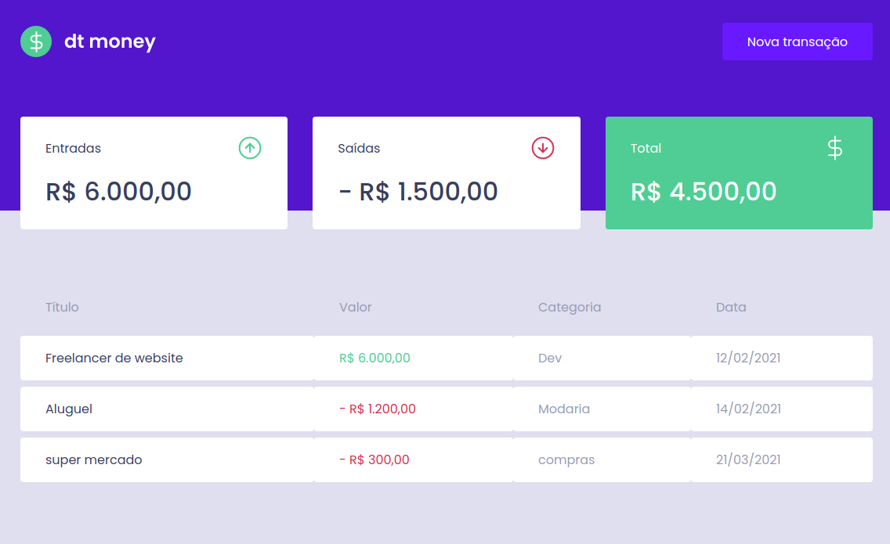
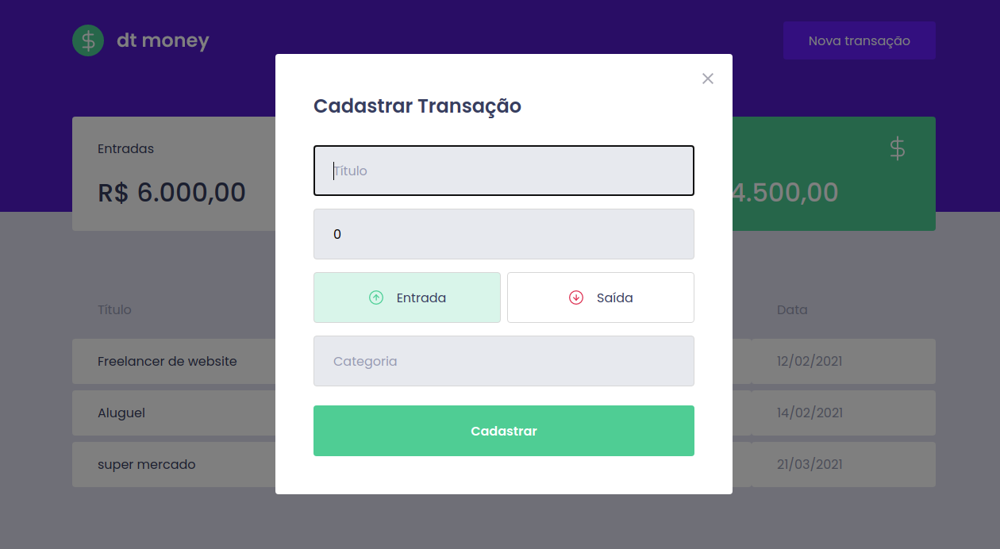

<h1>Projeto dt money</h1>
Aplicação prática e simples para gerenciamento das despesas pessoais.
Desenvolvido no programa Ignite da rocketseat.

## 🚀 Tecnologias

Esse projeto foi desenvolvido com as seguintes tecnologias:

- [React]
- [MirageJs]

## 💻 Projeto

  <h4>Features:</h4>
  <ul>
    <li>Dashboard de apresentação das entradas e saídas e o balanço total (entradas - saídas)</li>
    <li>Para criação de uma nova transação o usuário clica no botão Nova transação, a qual abre um modal para a inserção da nova transação</li>
  </ul>

## 🔖 Layout

<table>
  <tr>
    <td><strong>Dashboard</strong></td>
    <td><strong>Modal</strong></td>
  <tr>
   <tr>
    <td></td>
    <td></td>
  <tr>
</table>

## Licença

Esse projeto está sob a licença MIT.

Execute yarn install ou npm install para instalação.
